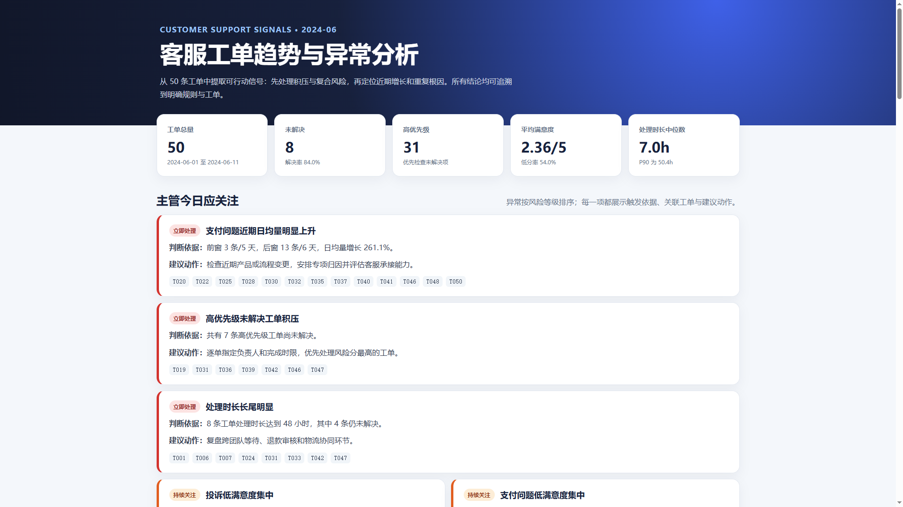

# 客服工单趋势与异常分析

一个面向客服主管的可复现分析工具：从 50 条工单中自动提取时间趋势、重复问题、风险积压、处理效率和客户体验信号，并生成结构化 JSON 与可离线打开的 HTML Dashboard。



## 快速开始

环境要求：Python 3.10+

```bash
python -m pip install -r requirements.txt
python run_analysis.py
```

生成结果：

- `report/dashboard.html`：单文件离线 Dashboard，可直接用浏览器打开
- `report/analysis_summary.json`：机器可读的结构化趋势与异常结果
- `report/dashboard.png`：Dashboard 展示截图

也可以分析其他同结构数据：

```bash
python run_analysis.py --input path/to/tickets.json --output-dir report
```

运行测试：

```bash
python -m pytest -q
```

## 分析维度设计

1. **工单量与时间趋势**  
   按日观察总量，并比较前窗（6 月 1–5 日）和后窗（6 月 6–11 日）的类别日均量。使用日均值消除窗口天数不同造成的偏差，帮助主管判断近期压力来自哪里。

2. **问题类型与文本主题**  
   在原有分类标签下，用可审计关键词归并“重复或错误扣款”“支付成功但订单异常”“退款审核或到账延迟”“退货运费报销”等细分主题。分类用于资源配置，主题用于定位具体根因。

3. **严重程度与风险积压**  
   交叉分析优先级、解决状态、处理时长和满意度，并用复合风险分排序。帮助主管形成可以直接跟进的待办清单。

4. **服务效率**  
   统计平均处理时长、中位数和 P90，并按类别、渠道比较。中位数描述常态，P90 揭示长尾，避免只看均值。

5. **客户体验**  
   分析平均满意度、1–2 分低分率，以及低分与类别、解决状态和处理时长的共现关系。帮助识别最伤害体验的环节。

6. **渠道差异**  
   比较在线与电话渠道的工单结构、解决率、低分率和处理时长，为分流与升级机制调整提供依据。

7. **关联风险**  
   联合观察“处理时长—满意度”“未解决—低满意度”“类别—高优先级”。关联仅表示样本内共现，不宣称因果。

## 关键趋势与异常

### 1. 支付问题近期显著增多

- 前窗：3 条 / 5 天，日均 0.60 条
- 后窗：13 条 / 6 天，日均 2.17 条
- 日均增长：**261.1%**
- 支付问题共 16 条，占全部工单 **32%**

建议优先检查近期支付链路、订单状态同步和扣款逻辑变更，而不是仅增加客服人力。

### 2. 扣款与订单状态异常反复出现

- “重复或错误扣款”共 6 条，低分 5 条，未解决 1 条；最近 3 天集中出现 3 条
- “支付成功但订单异常”共 6 条，低分 4 条

这两个主题共同指向支付成功后的资金与订单状态一致性风险，应按支付渠道和订单状态链路合并排查。

### 3. 高优先级积压需要立即处理

- 总计 8 条未解决工单
- 其中 **7 条为高优先级**
- 最高风险工单集中在退款退货：`T031`、`T047`、`T042`

建议逐单明确负责人和完成时限，并优先处理同时满足“未解决 + 高优先级 + 低满意度 + 超长处理”的工单。

## 建议行动方案

### 支付问题：三路并行

1. **资金扣款一致性（支付平台 + 财务）**

   4 小时内先止损，按支付渠道核对扣款流水、幂等键和退款状态；24 小时内给出重复或错误扣款的根因。
2. **订单状态同步（订单平台 + 支付平台）**

   核对支付回调、消息重试和订单状态机；4 小时内确认受影响订单，24 小时内修复或完成补偿。
3. **结算可用性（交易前端 + 支付平台）**

   检查结算页错误日志、第三方支付可用性和客户端兼容性；8 小时内定位，48 小时内完成修复验证。

### 高优先级积压：建议跟进顺序

| 顺序 | 工单 | 问题类型 | 风险分 | 建议负责人 | 建议时限 |
|---:|---|---|---:|---|---|
| 1 | T031 | 退款退货 | 11 | 售后退款负责人 | 2 小时内介入，24 小时内闭环 |
| 2 | T047 | 退款退货 | 11 | 售后退款负责人 | 2 小时内介入，24 小时内闭环 |
| 3 | T042 | 退款退货 | 11 | 售后退款负责人 | 2 小时内介入，24 小时内闭环 |
| 4 | T019 | 物流查询 | 9 | 物流协同负责人 | 4 小时内介入，48 小时内闭环 |
| 5 | T039 | 退款退货 | 9 | 售后退款负责人 | 4 小时内介入，48 小时内闭环 |
| 6 | T036 | 退款退货 | 9 | 售后退款负责人 | 4 小时内介入，48 小时内闭环 |
| 7 | T046 | 支付问题 | 9 | 支付专项负责人 | 4 小时内介入，48 小时内闭环 |

以上负责人和时限是分析建议，并非原始数据中的实际分派或企业正式 SLA。执行时应为每条工单登记当前阻塞、下一次客户回访时间和最终闭环结果。

### 4. 退款退货存在明显处理长尾

- 退款退货共 13 条，解决率仅 **61.5%**
- 平均处理时长 45.23 小时，中位数 24 小时，P90 达 96 小时
- “退货运费报销”主题共 4 条，解决率仅 50%，平均处理时长 52 小时
- 全部工单中有 8 条处理时长达到 48 小时，其中 4 条仍未解决

建议复盘退款审核、运费报销和跨团队等待节点。

### 5. 客户体验整体承压

- 平均满意度：**2.36 / 5**
- 低分率（1–2 分）：**54%**
- 投诉低分率 100%，物流查询 75%，退款退货 61.5%，支付问题 56.2%

商品咨询平均满意度 4.2、平均处理时长 0.9 小时，说明体验问题主要集中在交易后链路，而非所有客服场景。

### 6. 电话渠道表现弱于在线渠道

- 电话渠道：解决率 75%，低分率 75%，处理时长中位数 24 小时
- 在线渠道：解决率 88.2%，低分率 44.1%，处理时长中位数 4 小时

该差异可能与电话承接的问题更复杂有关，不能直接归因为坐席能力；建议结合升级规则和问题结构进一步核查。

## 异常判定规则

- **类别激增**：后窗至少 5 条，且日均量较前窗增长不低于 50%
- **重复主题**：同一细分主题至少出现 2 次；包含未解决、低分或最近 3 天聚集时提高等级
- **高风险积压**：高优先级且未解决直接列为“立即处理”
- **处理长尾**：处理时长达到 48 小时，或超过所属类别 P90
- **体验异常**：类别样本至少 3 条且低分率不低于 50%，或单条工单未解决且评分不高于 2
- **复合风险分**：未解决 +4，高优先级 +3 / 中优先级 +1，低满意度 +2，处理时长达到 48 小时 +2

每个异常都包含判断依据、关联工单 ID 和建议动作。48 小时是本分析的观察阈值，不代表企业正式 SLA。

## 项目结构

```text
.
├── data/                       # 原始工单与字段说明
├── docs/superpowers/specs/     # 设计文档
├── report/                     # JSON、HTML 与截图
├── src/
│   ├── analyze.py              # 校验、指标、主题和异常检测
│   └── render_report.py        # Plotly 离线 Dashboard
├── tests/                      # 指标、规则与报告测试
├── run_analysis.py             # 命令行入口
└── requirements.txt
```

## AI 工具使用情况

- 使用 Cursor AI 协助梳理需求、设计分析维度、编写与检查代码，以及组织报告表达。
- 运行时的数据校验、指标计算、关键词主题归并和异常检测均由仓库中可见的确定性 Python 代码完成。
- 工单内容不会在运行时发送给外部在线模型，报告可离线复现。
- 所有关键发现均由原始字段、统计值和明确规则支持，AI 不作为最终判断依据。

## 数据限制

- 数据仅有 50 条，覆盖 2024-06-01 至 2024-06-11；“趋势”仅表示样本内前后窗口变化。
- 文本主题使用明确关键词归并，目标是可解释和可复现，不等同于完整的自然语言语义分类。
- 渠道差异可能受到问题复杂度和分流规则影响。
- 当前数据适合描述性分析和异常筛查，不支持长期预测或因果推断。
